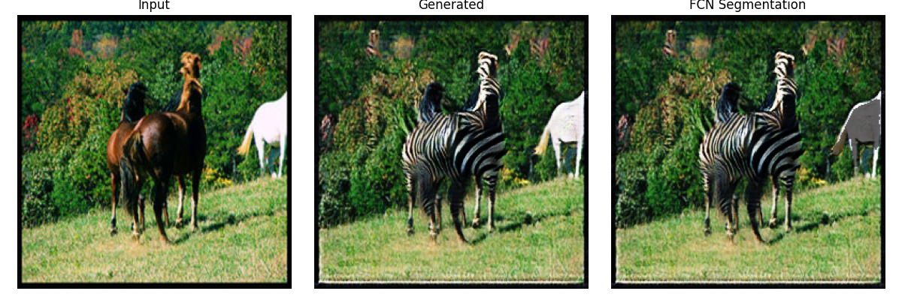
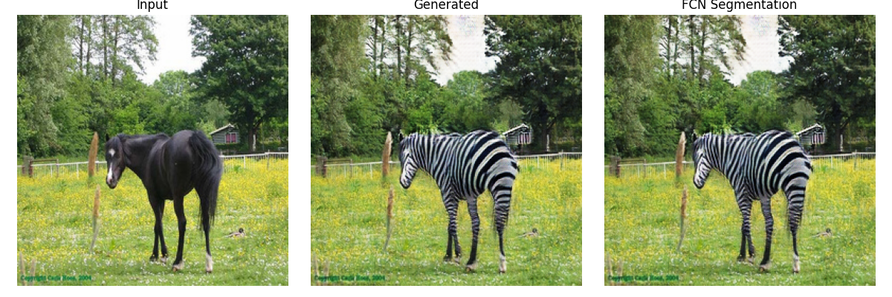
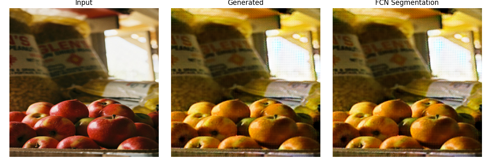

# CycleGAN for Unpaired Image Translation

This project implements **Cycle-Consistent Adversarial Networks (CycleGAN)** for unpaired image-to-image translation, inspired by [junyanz/pytorch-CycleGAN-and-pix2pix](https://github.com/junyanz/pytorch-CycleGAN-and-pix2pix). Our work focuses on translating images between:
- 🐴 Horse ↔ 🦓 Zebra
- 🍎 Apple ↔ 🍊 Orange

We trained and tested our model on these domains using unpaired datasets. Sample output images are included in the `outputs/` directory.

---

## ✨ Sample Results

### Horse ↔ Zebra

| Input (Horse) | Translated (Zebra Style) |
|---------------|---------------------------|
|  |  |

---

### Apple ↔ Orange

| Input (Apple) | Translated (Orange Style) |
|---------------|----------------------------|
|  | *(Sample output shown on left)* |

---

## 📁 Dataset

We used the following datasets from the [CycleGAN dataset collection](https://people.eecs.berkeley.edu/~taesung_park/CycleGAN/datasets/):
- `horse2zebra`
- `apple2orange`

To download datasets:

```bash
bash ./datasets/download_cyclegan_dataset.sh horse2zebra
bash ./datasets/download_cyclegan_dataset.sh apple2orange

